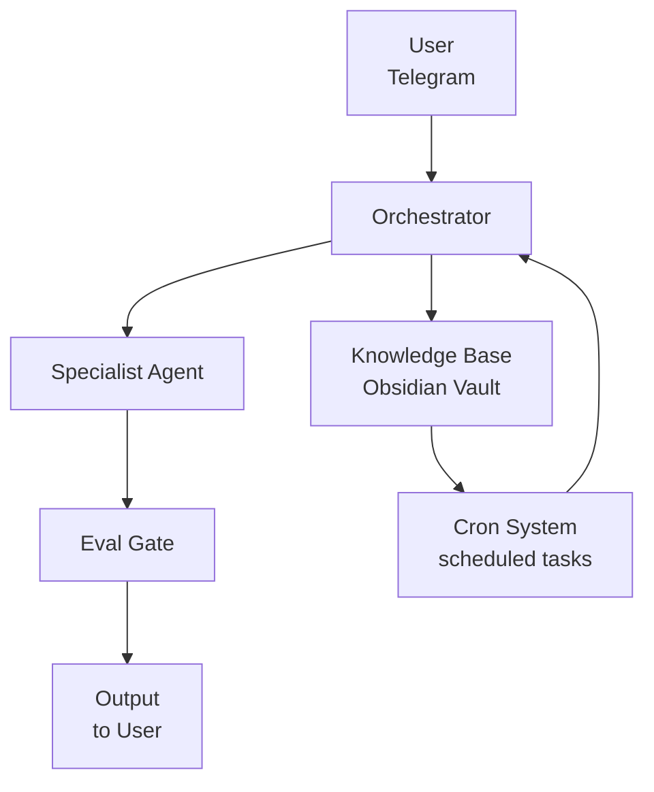

# Architecture — GBrain

## System Overview

GBrain is a multi-agent AI system built on Hermes Agent. It orchestrates specialist agents that handle different business functions, all running locally on a single machine.

## Core Components

### 1. Orchestrator (gBrain SOUL.md)

The central brain. Routes incoming tasks to the appropriate specialist agent based on task type, context, and priorities.

**How it works:**
- Receives triggers (Telegram messages, cron events, Stripe webhooks)
- Analyzes the trigger and determines which specialist(s) should handle it
- Delegates with a structured task specification (SDD format)
- Reviews output against quality criteria
- Delivers final output to the user

**Routing table:**

| Task Type | Specialist | Signal Words |
|-----------|-----------|--------------|
| Content creation | Content Creator | "write", "post", "thread", "article" |
| Strategic analysis | PM Expert | "trade-off", "roadmap", "decision" |
| Operations | Ops Expert | "kanban", "briefing", "workflow" |
| Financial analysis | Financial Agent | "payment", "revenue", "churn", "CAC" |

### 2. Specialist Agents

Each agent is a focused worker with specific expertise:

#### Content Creator
- Generates content for 3 brands (NatyShi, esembee, IPY Now)
- Produces 11 pieces per trigger (LinkedIn, X, blog, video scripts)
- Includes visual asset generation (headers, infographics)
- Mandatory X Post Audit for X content

#### PM Expert
- Strategic analysis and trade-offs
- PRD creation and review
- Product roadmap decisions
- Risk assessment

#### Ops Expert
- Kanban board management (Obsidian plugin)
- Morning briefing (9am) and evening wrap-up (7pm)
- Workflow optimization
- Metrics tracking

#### Financial Agent *(documented, in development)*
- Transaction classification and analysis
- Unit economics calculation (CAC, LTV, churn, revenue)
- Risk detection and alerting
- Strategic financial recommendations
- Human-in-the-loop via Telegram
- Monthly report generation

### 3. Eval Gates

Every output passes through quality checks before reaching the user:

**Content Creator Eval Gate:**
- Voice/tone match
- Platform correctness
- CTA clarity
- Hook effectiveness
- Visual assets included
- X Post Audit score ≥ 60

**PM Expert Eval Gate:**
- Data-backed analysis
- Trade-offs explicitly presented
- Recommendation with reasoning
- Actionable output

### 4. Knowledge Base (Obsidian Vault)

```
hermes-brain/
├── Content/Generated/     ← Content pieces with tracking frontmatter
├── Knowledge-Base/        ← PRDs, setups, infrastructure docs
│   ├── Proyectos/         ← Project-specific docs
│   └── Idea-Pantry/       ← Idea bank for future work
├── Sessions/              ← Daily to-dos and session summaries
└── gBrain-OS/             ← System config and kanban
```

### 5. Cron System

Runs on VM (24/7 availability):
- **Morning Briefing (9am):** Tactical pending focus, kanban status, metrics
- **Evening Wrap-up (7pm):** Completed tasks, idea triggers, carry-forward

### 6. Telegram Integration

Always-on assistant accessible from phone:
- Receives triggers (tasks, questions, approvals)
- Delivers outputs (content, reports, alerts)
- Human-in-the-loop for financial decisions

## Data Flow



## Security Model

### Current
- Local execution on user's machine
- No telemetry, no data collection
- All memory stored in ~/.hermes/

### Future (OpenShell)
- Sandboxed execution per agent action
- Microsoft security primitives integration
- Audit trail for every operation
- Enterprise-ready for IT compliance

## Hardware Requirements

### Minimum (current)
- Any machine with Python 3.11+
- 8GB RAM
- Internet connection for cloud models

### Recommended (full stack)
- NVIDIA RTX Spark or equivalent GPU
- 16GB+ RAM
- Local model inference via Nemotron
- 24/7 operation capability

## Tech Stack

| Component | Technology | Status |
|-----------|-----------|--------|
| Agent Framework | Hermes Agent (Nous Research) | ✅ Working |
| Orchestrator | gBrain SOUL.md + SDD | ✅ Working |
| Knowledge Base | Obsidian + Git sync | ✅ Working |
| Cron System | Hermes cron (VM) | ✅ Working |
| Telegram Bot | Hermes Telegram integration | ✅ Working |
| Sandbox | OpenShell (NVIDIA) | 📋 Conceptual |
| Local Inference | Nemotron (NVIDIA) | 📋 Conceptual |
| Financial Ops | Stripe Skills | 📋 Conceptual |

---

*Architecture documented: 2026-06-17*
