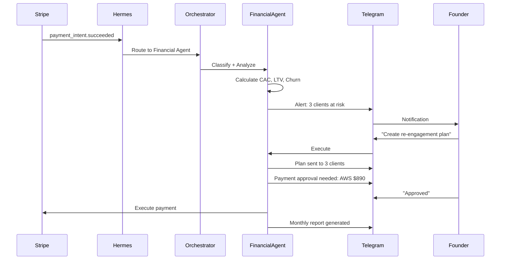

# Demo Flow - End-to-End: "From Payment to Strategic Decision"

## Overview

This document describes the end-to-end flow demonstrated in the hackathon video. It shows a complete financial cycle: from a Stripe payment arriving to the founder making a strategic decision based on data.

## Flow Diagram

## The Flow

### Step 1: Payment Arrives

**Trigger:** Stripe processes a payment → webhook fires → Hermes receives event

**What happens:**
- Stripe `payment_intent.succeeded` event fires
- Hermes Agent receives the webhook
- Orchestrator routes to Financial Agent

**Data:**
- Amount: $2,500 USD
- Client: TechCorp México
- Type: Recurring (Monthly subscription)
- Exchange rate: $2,500 USD → $3,625,000 ARS (official rate)

### Step 2: Agent Classifies and Analyzes

**What the Financial Agent does:**
1. Classifies transaction: Revenue, Recurring
2. Updates client record: 13th month active
3. Calculates client-specific metrics:
   - CAC: $340 USD (acquisition cost for this client)
   - LTV: $12,600 USD (36 months × $350/month projected)
   - LTV/CAC: 37x (excellent)
   - Payback: 1.2 months (excellent)
4. Updates business-wide metrics:
   - Monthly revenue: $16,250 → $18,750 (+15%)
   - Active clients: 45
   - MRR: $18,750

### Step 3: Risk Detection

**What the agent detects:**
- Churn rate: 4.2% this month (up from 3.5% average)
- 3 clients didn't renew
- Revenue at risk: $4,200/month
- CAC increased 18% this month ($380 → $450)
- LTV/CAC ratio: 2.1x (below healthy 3x threshold)

**Industry benchmarks (real data):**
- Average B2B SaaS monthly churn: 3.5% (SaaSHero, 2025)
- Healthy LTV/CAC ratio: 3-5x (HBS, 2025)
- SMB SaaS CAC range: $200-$700 (Mowsix, 2026)

### Step 4: Strategic Advice

**Agent sends to founder via Telegram:**

> I detected 3 clients at churn risk. Pattern: all stopped using Feature X in the last 2 weeks.
>
> Recommended action: Personalized re-engagement campaign.
> Should I create the plan and send it?
>
> Also: your CAC increased 18% this month. LinkedIn Ads cost went up. Should I review alternatives?

**Data backing the recommendation:**
- 3 clients × $1,400/month each = $4,200/month revenue at risk
- Pattern: Feature X usage dropped 80% in 2 weeks
- Industry benchmark: re-engagement campaigns recover 15-25% of at-risk clients
- Estimated recovery: $630-$1,050/month

### Step 5: Human-in-the-Loop

**Founder approves from Telegram:**
- "Yes, create the plan and send it to the 3 clients"
- Agent executes: creates plan, sends to 3 email addresses

**Supplier payment approval:**
- Agent: "Payment approval needed: AWS — $890 USD — Due in 3 days"
- Founder: "Approved"
- Agent: "Payment scheduled for June 20"

### Step 6: Monthly Report

**Auto-generated report includes:**

| Metric | Value | Status |
|--------|-------|--------|
| Revenue | $18,750 | +15% ✅ |
| Churn | 4.2% | Above 3.5% ⚠️ |
| CAC | $450 | +18% ⚠️ |
| LTV/CAC | 2.1x | Below 3x 🔴 |
| Net Margin | 62% | Healthy ✅ |

**Upcoming payments:**
- Suppliers: $2,400 USD
- Payroll: $8,500 USD (4 people)
- Total: $10,900 USD

**Action items:**
1. Re-engagement campaign (sent)
2. Review LinkedIn Ads CAC
3. Monitor churn next 2 weeks

## Modular Extensions (Conceptual)

### OpenShell Sandbox
- Every financial operation runs in an isolated sandbox
- IT teams can audit every action the agent takes with money
- Data never leaves the machine
- Microsoft security primitives for enterprise compliance

### DGX Spark + Nemotron
- AI model runs locally on DGX Spark
- Financial data never leaves the machine
- No cloud dependency, no subscriptions
- 24/7 operation on dedicated hardware

### Stripe Skills
- Receive payments via Stripe webhooks
- Execute supplier payments via Stripe API
- Automated payroll processing
- Multi-currency support with real-time exchange rates

## Data Sources

All metrics in the demo use real industry benchmarks:

| Metric | Value | Source |
|--------|-------|--------|
| B2B SaaS monthly churn | 3.5% | SaaSHero, 2025 |
| SMB SaaS CAC | $200-$700 | Mowsix/LTV-CAC Book, 2026 |
| Healthy LTV/CAC ratio | 3-5x | HBS/CharliA, 2025-2026 |
| CAC increase (8 years) | +222% | Shno.co, 2026 |
| LATAM SMBs digital payments | 85% | CEPAL, 2025 |

---

*Demo flow documented: 2026-06-17*
