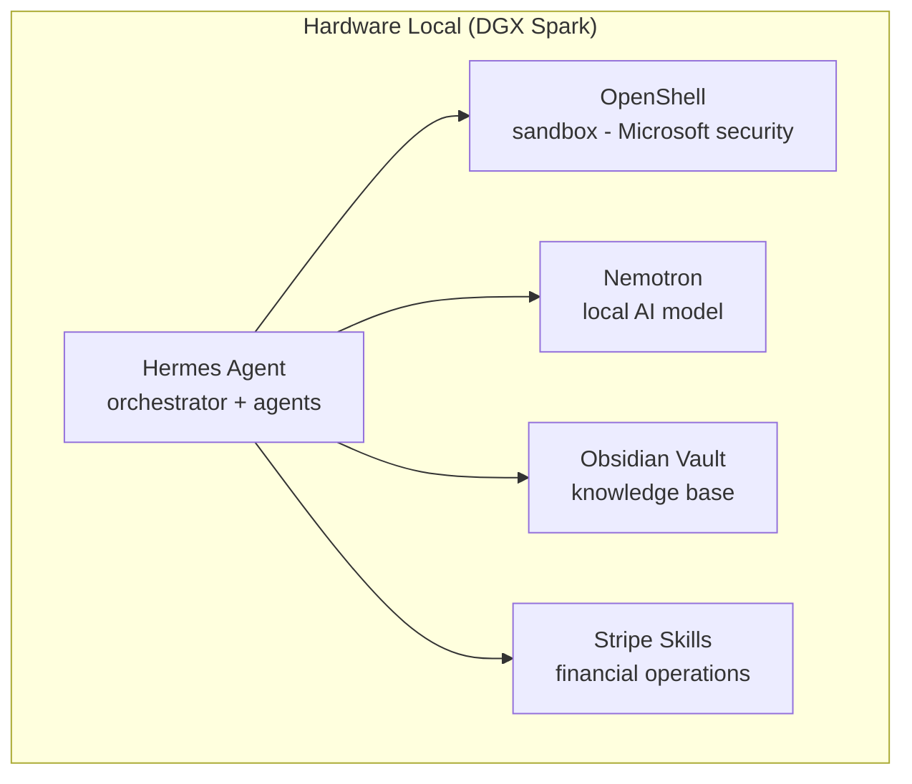
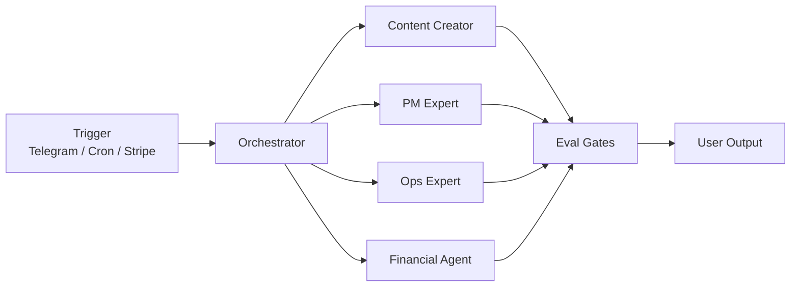
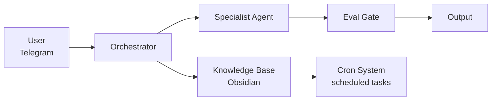

# esembeeGBrain: AI Team Running Locally for SMBs

> An autonomous AI team that runs on your own hardware - secure, modular, and built for small businesses in LATAM and emerging countries.

## The Problem

Small businesses in Latin America, and emerging countries in general, face three walls:

1. **Cost** - They can't afford specialized teams for content, finance, and operations. AI tool subscriptions pile up.
2. **Dependency** - Everything lives in third-party clouds. If the service goes down, the business stops. If prices go up, the business adjusts or dies.
3. **Security** - When they try to adopt AI, IT teams block it. "Your AI stack is amazing, but we won't let it touch our data."

## The Solution

**esembeeGBrain** is an autonomous team of AI agents that runs locally on your own hardware. It's not a chatbot. It's not an app. It's a team of specialists working for your business 24/7.

### What it does today

- **Orchestrator** - Routes tasks to specialist agents via structured task specifications
- **Content Creator** - Generates 11 pieces of content per trigger across 3 brands
- **PM Expert** - Strategic analysis, trade-offs, PRDs
- **Ops Expert** - Kanban management, daily briefings, workflow optimization
- **Financial Agent** *(documented, in development)* - CFO + Growth Advisor: analyzes unit economics, detects churn risk, advises on financial decisions
- **Eval Gates** - Automatic quality assurance on every output
- **Cron System** - Morning briefing + evening wrap-up, running 24/7
- **Telegram Integration** - Always-on assistant from your phone

### What it will do (modular extensions)

- **Stripe Skills** - Receive payments, pay suppliers, automated payroll
- **OpenShell Sandbox** - Secure execution with Microsoft security primitives
- **Nemotron + DGX Spark** - Local AI inference, no cloud dependency

## Architecture



### Agent Routing



### Data Flow



## Quick Start

```bash
# Install Hermes Agent
curl -fsSL https://raw.githubusercontent.com/NousResearch/hermes-agent/main/scripts/install.sh | bash

# Configure
hermes setup

# Run
hermes
```

## Built With

- [Hermes Agent](https://github.com/NousResearch/hermes-agent) - Open-source AI agent by Nous Research
- [NVIDIA OpenShell](https://nvidianews.nvidia.com/news/ai-agents) - Secure sandbox runtime
- [Stripe Skills](https://stripe.com) - Financial operations for agents
- [Obsidian](https://obsidian.md) - Knowledge base and workflow management

## Repository Structure

```
esembee-brain/
├── README.md                    ← You are here
├── ARCHITECTURE.md              ← System architecture
├── DEMO-FLOW.md                 ← End-to-end demo flow
├── FINANCIAL-AGENT.md           ← CFO + Growth Agent spec
├── SKILLS/
│   ├── content-creator/README.md
│   ├── pm-expert/README.md
│   ├── ops-expert/README.md
│   └── financial-agent/README.md
├── MODULES/
│   ├── stripe-conceptual.md     ← Stripe Skills integration
│   ├── openshell-conceptual.md  ← OpenShell sandbox
│   └── nemotron-local.md        ← Local AI inference
└── VIDEO/
    ├── storyboard.md            ← Hackathon video script
    └── assets/                  ← Video assets
```

## Team

Built by [esembee](https://esembee.com) - modular platform for SMB growth.

Powered by [NatyShi](https://x.com/NatyShi_) - solopreneur, product strategist, building in public from LATAM to the world.

---

*Built for the [Hermes Agent Accelerated Business Hackathon](https://x.com/NousResearch) - NVIDIA × Stripe × NousResearch*
